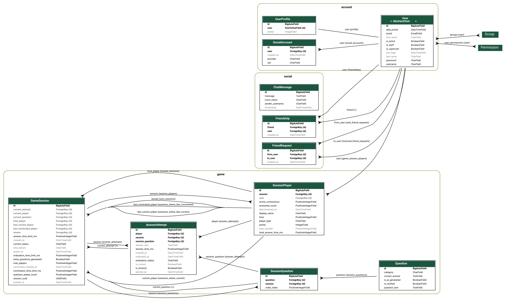

*This project has been created as part of the 42 curriculum by dbozic, itykhono, jzackiew, mamichal, mbudkevi.*

# 42_ft_transcendence

## 🟥Description🟥 ```overview & clear name```
**QUIZSENDENCE** is a **Game Show Webapp** that lets you and your friends take part in a gameshow based on Polish TV format "1 z 10".

### Key features ``key features``

- **Online Multiplayer** Game Show based Quiz.
- **Friends system**.
- **Text chats** between Friends.
- **Player Statistics**.
- **Player Profiles** with avatars.
- **AI** based question generator for lobbies.

### How to win?

The game show has you gain points by answering questions correctly. You must avoid answering incorrectly as you lose one of your three lives for each question you get wrong!

Unlike other game shows where contestants rush to answer first, players nominate each other in a system of "hand down the hot seat" to try eliminate the other players.

The winner is chosen when all the questions are answered, or if all but one player have fallen.

**Do you have what it takes to win?**

### Make a profile, add friends and chat

We provide a player profile along with friends system to allow players to chat between games!

Found a worthy opponent and want a rematch? **Add them to friends and send them a room key!**

Had enough of losing to them? **Unfriend them and see them disappear!**

### How to play?
Want to host a game? **Register or Log in, Create a lobby, and send your friends the lobby ID.**

Having trouble joining a friend who is already hosting lobby? **Register or Log in then press JOIN ROOM and ask your friend for the room code.**

### Why Quizsendence? ```goal```
Our goal was to recreate the game show Polish TV gameshow format "1 z 10" in a webapp form. Each person's personal goal was to get hands-on experience with web development technologies that were new to us.

## 🟪Instructions🟪

    [!IMPORTANT]
    Designed for Unix systems only. No support for Windows/MacOS.

### Prerequisites
- `Make`
- `Docker` (ver. 24.0+) and `Docker-compose`
- `Git`

### Instalation
```bash
  cp .env.example .env
  make up
```

In order to experience all of the app's fetures fill the following credentials in the `.env` file:
```
# --- AI Configuration ---
LLM_API_KEY=

# --- Google OAuth ---
GOOGLE_OAUTH_CLIENT_ID=
GOOGLE_OAUTH_CLIENT_SECRET=
GOOGLE_OAUTH_REDIRECT_URI=
```

### Running
After successful build visit
```
https://localhost:8443
```
in Chrome/Firefox browser.

## 🟦Resources🟦

### General References ``section listing classic references related to the topic (documentation, articles, tutorials, etc.)``

- [Django Rest Framework](https://www.django-rest-framework.org/)
- [Django ORM](https://docs.djangoproject.com/en/6.0/topics/db/models/)
- [Django Authentication](https://docs.djangoproject.com/en/6.0/topics/auth/)
- [Django Migrations](https://docs.djangoproject.com/en/6.0/topics/migrations/)
- [Redis](https://channels.readthedocs.io/en/stable/topics/channel_layers.html)
- [Service layer pattern](https://github.com/HackSoftware/Django-Styleguide)
- [Websockets docs and tutorial](https://channels.readthedocs.io/)
- [Gemini integration](https://ai.google.dev/gemini-api/docs)
- [React docs](https://pl.react.dev/)
- <Fill_in_or_delete> <ITYKHONO>
- <Fill_in_or_delete> <MAMICHAL>
### AI Usage ```a description of how AI was used specifying for which tasks and which parts of the project.```

**We used a wide range of AI assistence when it came to work and research. Below is listed all the uses of AI our team utilised:**
- **Research** on how to use new techologies.
- Assistance with **design choice research** along with **CSS styling** help.
- **Code summarisation** for individual understanding foreign sections of the codebase.
- **Writing tedious and repetitive code that was already understood.**
- **Debugging** tasks and **error summarisation**.
- **Code refactoring**

## 🟩Additional sections🟩

### 🟥 Team Information

**We separated our work into roles defined within the subject** ``Assigned roles, Brief description of their responsibilities``

- **Project Owner** - **jzackiew** - Responsible for the vision of the project, set priorities for features and ensured the project met the subjects and team goals.
- **Scrum Master** - **dbozic** - Responsible for organising the team and their productivity. Facilitated team Brain Storming and held meetings to settle on a project plan. Scheduled common Scrum meetings to keep everyone up to date and clear blockers.
- **Tech Lead** - **mamichal** - Responsible for the choice of technological stack, researched different architectural decisions and proposed solutions based on data and our unique use case.
- **Developer** - **mbudkevi** - Responsible for implementing assigned features, writing tests, reviewing teammates' pull requests and documenting changes.
- **Developer** - **itykhono** - Responsible for frontend implementation, frontend file structure architecture.

### 🟪 Project management

#### Team organisation ``task distribution, meetings, project management, communication channels, and tools used for project management.``

**Meetings** - We held many meetings throughout our time working together. We first held organisational meetings, followed by meetings to find the project idea we would work on as well as our Project Owner. When work started on the project we began with our **weekly meetings** later transitioning into **bi-weekly meetings**, then **daily meetings** once we entered our crunch.

**Project Management** & **Task distribution** - Utilising **Github Projects** jzackiew set up the initial issues list to conform with his business requirements. The whole team **would take the highest priority issues and work on them** on separate branches. Once an issue was finished we would have other members of the team review it and give feedback before it was either rejected or merged with main.

**In general we split our work into areas**. **dbozic** focused on AI and auxillary tasks, **itykhono** focused on frontend, **jzackiew** focused on game logic, **mamichal** focused on devops and **mbudkevi** focused on backend. This was a general guideline for who would take what.

**Communication Channels** - We used **Slack** for messaging, **Google Meet** for anyone who couldn't make it to our meetings in person, and **Github projects** to communicate large issues and code reviews. **A lot of our communication came from sitting together on campus**.

### 🟦 Technical Stack ``frontend stack & framework, backend stack & framework, database system and why it was chosen, any other significant technologies or libraries, justification for major techncal choices``

- **Frontend technologies and frameworks**
  - **TypeScript 6.0** - Frontend Language.
  - **Vite 8** - Frontend build tool and dev server.
  - **React 19** - web framework.
  - **CSS Modules** - styling solution.
- **Backend technologies and frameworks**
  - **Python 3.13** - Backend Language.
  - **Django 6.0 + DRF** - backend framework. 
  - **Django Channels + Daphne** - ASGI server + handling WebSockets.
- **Database system**
  - **PostgreSQL** - Persistent relational database engine.
- **Any other significant technologies or libraries**
  - **Docker and Docker Compose** - containerization.
  - **Google Gemini API** - AI questions generation.
  - **Python Statemachine** - Game finite state machine.
  - **Redis** - channel layer + caching.
  - **Nginx** - Proxy.
  - **Playwright** - E2E testing.

### 🟦 Justification for major technical choices
- **Django + DRF** — it is very robust, comes with an ORM, auth and serializers out of the box, so we didn't have to build that ourselves.
- **Channels + Redis** — the game and chat both happen in real time, so we needed WebSockets. Channels handles that and is the standard when it comes to Django-based backends dealing with WebSockets. Redis handles caching and broadcasting messages (pub/sub) and is easily accessible in Django.
- **python-statemachine** — the game logic would be too convoluted with use of plain if-else statements. That's why it was natural to use a finate state machine for managing the game phases transitions. This particular library is well-established for Python.
- **PostgreSQL** — well supported in Django (ORM), relational and is considered an industry standard.

### 🟩 Database Schema


- **Online Multiplayer** Quiz Game Show.
- **Account Management**.
- **Friends system**.
- **Text chats** between Friends.
- **Text chats** between Friends.
- **Player Statistics**.
- **LLM** based question generator for lobbies.

**Complete list of implemented features:**

**Online Multiplayer Game Show based Quiz** - An online game which players can host then compete in by nominating players to answer game show questions.
<br> **Game Design**, **Fullstack Implementaton** by: **jzackiew**.
<br> **Game instructions** by: **mbudkevi.**

**Accounts and Account Management** - User account creation and profiles which display a players information along with user online presence.
`<br>` **Authentication** by: **mamichal and mbudkevi**.
`<br>` **Google OAuth and is online status** by: **mbudkevi**.
`<br>` **Frontend implementation** by: **itykhono**.

**Friends System** - A system where players can search for other players by username. They can add or remove friends to open a direct text chat.
`<br>` **Backend logic design and database relationship model** by: **mbudkevi**.
`<br>` **Frontend implementation** by: **itykhono**.

**Text Chats** - A websocket based system that allows users to directly communicate to each other by text chat live. You can text chat with friends while in public lobbies as well as in the home page.
`<br>` **Websocket Architecture**, and **History Pagination** by: **jzackiew**.
`<br>` **Backend Chat Logic**, and **Authentication** by: **mbudkevi**.
`<br>` **Frontend implementation** by: **itkyhono**

**Player Statistics** - A place on the home page where users can check their game statistics.
`<br>` **Statistic Tracking** by: **jzackiew**.
`<br>` **Frontend integration** by: **itykhono**.

**LLM based question generator for lobbies** - A button that allows the host of a lobby to add more questions to his quiz using AI. The AI generates similar questions to those already present in the lobby. The generated questions are added to the database for admin review and integration into the games questionbase.
`<br>` **LLM Integration**, **Game Session Integration**, **Database Persistence**, **Rate limitation**, and **Duplicate Protection** by: **dbozic**.
`<br>` **Frontend integration** by: **jzackiew**.

### 🟧 Modules ``List all chosen modules, point calculation, justification for each choice, how each module was implented, which team members did what``

### Complete list of chosen modules

## 🌐 Web

### Minor - Use a frontend framework

**React** was our choice of frontend as it is the most popular framework ever.

**Axios** simplifies REST API calls by handling JSON parsing and error responses automatically.

**CSS Modules** scoped class names per component

**Vite** tprovides instant dev server startup and hot module replacement (HMR), so you see changes in the browser immediately without a full page reload

### Minor - Use a backend framework

- **People Involved: jzackiew, mbudkevi, mamichal**
- We used **Django + DRF** as our backend framework.
- **Why this module?** - **Django** was chosen for its great out of the box capabilities like the **Object-Relational Mapping** which made it easier to interact with the database without including SQL queries inside the Python code. It allowed us to use **Django Channels + Redis** for caching and channels (WebSockets).

### Major - Implement real-time features using WebSockets or similar technology

- **People Involved: jzackiew, itykhono** 
- The whole game runs over a single WebSocket connection per player. Each game session is a group on the channels layer, which lets the server broadcast to everyone in that lobby at once. The game updates are based on constantly broadcasted snapshots containing information about the whole session, players and their actions. Players and spectators all render from that same snapshot. The consumer also handles graceful **reconnection**, **disconnection** and server-side **timers** so a round keeps moving even if a player goes quiet.
- **Why this module?** - It was crucial to have a real-time connection in the game like this to provide a good UX. WebSockets were the natural fit — the server can push the new state the instant it changes.

### Major - Allow users to interact with other users

- **People Involved: jzackiew, mbudekevi, mamichal, itykhono**
- We have a /home/ page where once logged in a user can look for users, view their profiles, add or remove them as friends and message with them using a live text chat.
- **Why this module?** - This module fit very well considering that an aspect of the game is making friends and talking about past or current matches. The idea of players interacting mid match or after a game to play again is a great addition.

### Minor - Use an ORM for the database

- **People Involved: jzackiew, mbudkevi, mamichal, dbozic**
- SQL queries inside the Python code is always an additional overhead, is prone to SQL Injections attacks. ORM allows to easily access the database with Python syntax.

### Minor - Custom made design system with reusable components, including a proper color palette, typography, and icons

- **People Involved: jzackiew, itykhono**
- There is a defined global colour palette, typography and fonts in one place. There are also a set of the following reusable components included: Button, Badge, Card, ErrorBanner, InputField, InlineError, Modal, SectionTitle, Avatar, OnlineIndicator, Icon, StatsGrid
- **Why this module?** - Shared set of tokens and design classes makes the whole app look consistent and easy to adjust on the global scale.

## 💠 Accessibility and Internationalization

### Minor - Support for additional browsers

- **People Involved: mamichal**
- Manually tested the app across different browsers both `Chromium (Blink + V8)` and `Firefox (Gecko + SpiderMonkey)` based. Implemented End to End tests with `playwright` to automate functional testing of the webapp's features and ensuring their proper behaviour.
- **Why this module?** - We wanted to make the app works flawlessly across different browsers and devices.

## 👥 User Management

### Major - Standard user management and authentication

- **People Involved: mbudkevi, mamichal**
- Custom `User` model extending Django's `AbstractUser` with a unique email. It consist of registration, login and logout endpoints. Login accepts either email or username. Avatar uploads through a separate `UserProfile` model. Online status is tracked in-memory by counting each user's open WebSocket connections, then broadcast over the same Channels layer the chat uses.
- **Why this module?** - Since the project is a multiplayer game, having accounts and profiles was the natural starting point. Without them there is no way to identify players between sessions and build a friends list.

### Minor - Implement remote authentication with OAuth 2.0

- **People Involved: mbudkevi**
- A `SocialAccount` model links a Django user to a Google identity. The login endpoint builds Google's authorization URL; the callback exchanges the code for a token, fetches the user's email and profile and either logs in the existing user or creates a new one and links it.
- **Why this module?** - Most users prefer one-click sign in and registration, so it adds convenience for users.

## 🔮 Gaming and user experience

### Major - Implement a complete web-based game where users can play against each other

- **People Involved: jzackiew** 
- The full game show is playable in the browser, from creating a lobby to a winner. The whole match runs as a server-side **state machine**. The server owns the rules: scoring, lives system, whose turn it is and when a round ends. Players answer questions and nominate each other in real time and everyone sees the same state pushed straight from the server.
- **Why this module?** - It is the core of the project.

### Major - Remote players — Enable two players on separate computers to play the same game in real-time

- **People Involved: mamichal, jzackiew**
- Players can join the same session from different machines over the network and play in real time. All they need to do is connect to the same session via unique UUID. The app is served behind **Nginx** over HTTPS so it can be reached from any computer, not just the host's.
- **Why this module?** - A game show is only fun with other people, so letting friends play together was the whole point.

### Major - Multiplayer game (more than two players)

- **People Involved: jzackiew**
- A lobby is designed to hold up to 5 players at once. The entire game mechanic is built around it: people can eliminate each other or form temporary alliances by nominating specific players. The game works the same whether there are two players or a full lobby, right down to the last one standing.
- **Why this module?** - It originates from the original "1 z 10" format as it is a multiplayer show by nature. Supporting more than two players was essential to recreating it. At the same time the number of players was limited to 5 instead of 10 to increase the dynamic of the match.

### Minor - Implement spectator mode for games

- **People Involved: jzackiew**
- If you join a lobby that's already in progress or one that's already full, you come in as a **spectator** instead of being turned away. Spectators receive the exact same live game state as the players but they cannot interfere.
- **Why this module?** - Normally a user would be just blocked from joining an already started or full game. We thought it's a good UX to allow them to watch their friends struggle with the questions.

## 🔮 Artificial Intelligence

### Major Module of Choice - LLM Question Expander System

- **People Involved: dbozic, jzackiew**
- It is shown as a host only button in the lobby screen. When pressed the lobby questions are sent to an LLM where additional similar questions are generated. Those questions are then added to the game session to be played, and saved persistently in the database for future use.
- **Why this module?** - We chose this module as it is a core concept of our game: AI generated questions. It also opened up the possibility of implementing RAG (Retrieval Based Generation) which could have been an additional Major Module.

- **What technical challenges it addresses** - The largest technical challenge with this module was **response validation**. LLMs are infamously bad at following exact rules. **Pydantic** was used for guaranteeing a safe answer format, and the content of the response was fine tuned through human readable instructions. Other challenges included **rate limiting**, and **integration** of answers into live lobbies and the persistent database.

- **How it adds value to your project** - Adding new, on theme but different, questions into each game prevents long time users from learning a majority of questions and their answers by heart. Generating questions adds excitement while also expanding the core question base that the quiz game relies on.  

- **Why it deserves Major module status (2 points).** - This module greatly resembles the module **"Major Module: Implement a complete LLM system interface"**. Below is a list of the requirements of the original module next to the counter part.
  - **Original:** Generate text and/or images based on user input.<br> **Counterpart:** Generate Questions with their answers and categories based on the current lobbies question pool.
  - **Original:** Handle streaming responses properly. <br> **Counterpart:** Handle updating a game sessions question base as well as implementing persistence for future use of the generated questions.
  - **Original:** Implement error handling and rate limiting. <br>**Counterpart:** Implement error handling and rate limiting.

## Devops

### Minor Module of Choice - Continuous Integration

- **People Involved: mamichal, jzackiew**
- Implement a Continuous Integration for the project providing instant developer
  feedback after running the provided test suite using GitHub Workflows.
- **Why this module?** - We chose this module because it helped us speed
up the development process. It allowed us to know when a pull request broke a functionality
and therefore fix it before any code review would be conducted. It also ensured
that all automated tests pass after merging to main branch.

- **What technical challenges it addresses** - It solves the problem of
automated testing to make sure that all the tests pass properly before
conducting a code review and verified that a merge conflict did not break any
of the functionalities and helped us save on development time.

- **How it adds value to your project** - It helps us make sure that everything
works as expected and ensures that we do not introduce bugs,
especially when merging a pull request to the main branch.  

- **Why it deserves Minor module status (1 points).** While not as extensive as
a full CI/CD pipeline (that could be seen as a Custom Major Module) it still
brings significant value in terms of safety and efficiency, as well as providing
the whole development team with automated feedback through the GitHub UI.

**Total Points = 22**

### ⬜️ Individual Contributions ``Detailed breakdown of what each team member contributed, specific features, modules, or components implemented by each person. any challenges faced and how they were overcome.``

### dbozic - Scrum Master

#### Contributions

- Implemented the AI-powered Question Expander.
- Lead researcher for potential AI modules and AI integration.
- Assisted in Code review and organised live game tests.
- Refined the questions data set for use in the final product.
- Organised meetings and removed blockers.
- Wrote the README.md.

#### Specific features, modules, or components

- AI Question Expander major module.
- LLM integration.
- User rate limiting for AI requests.
- Database persistence and updating live lobbies.
- Documentation.

#### Challenges faced

- My largest technical challenge was developing and integrating the question expander. It required me to learn new tools like Python, an authenticated API, a web development framework, an ORM, REST, rate limiting specific users, using external tools for format validation along with many other things that were cut from the final version.
<br> Looking back I am amazed I was able to start work on such a module as my first issue.
- A small but unusual challenge I faced was reforming the base list of questions and answers originating from a Polish gameshow. I found a method to automatically filter out questions which only people familiar with Polish culture would know along with translating and sorting the rest.

### itykhono - Developer `<ITYKHONO>`

- **Frontend developer responsible for the full client-side implementation, including component architecture, routing, API integration, WebSocket-based real-time communication, and frontend project structure.**

### jzackiew - Product Owner
#### Contributions
- Owned the product vision: defined the business requirements and set up and prioritised the GitHub Projects issue list the whole team worked from.
- Set up the initial backend Django framework.
- Designed and built the game end to end with the rules, the server-side state machine and the real-time WebSocket layer behind both the game and the chat.
- Built the custom design system and led the move from global CSS to scoped CSS Modules.
- Integrated the AI question generator into the game.

#### Specific features, modules, or components
- Complete web-based game (Major)
- Real-time features over WebSockets (Major) — per-lobby broadcasting, server-side round timers and automatic reconnection.
- Custom design system (Minor) — reusable components and a custom SVG icon set.
- Player statistics tracking and the AI question generator integration.

#### Challenges faced
The biggest challenge I've faced was non-coding related - for the first time I led a project with this many people and it showed me how important communication is and how difficult specifying concrete tasks might be.
When it comes to coding - I've never had anything to do with state machines before and it was tricky for me to grasp the idea behind it.
Getting to know the TypeScript with React took me the longest. I didn't plan to deal with the frontend initially but now I'm happy I got to learn a lot of new concepts related to the UI.

### mamichal - Tech Lead

#### Contributions

- DevOps and backend developer, focused mainly on setup of the environment and
ensuing proper deployment across multiple systems. Also contributed to some
frontend tasks.

#### Specific features, modules, or components

- DevOps - setting up a containerized environment with proper communication and
volume persistence for both the production environment and development playground
- Automated deployment via Makefile
- Added other useful automations for development purposes
- Contributed to CI setup
- Configured NGINX as a reverse proxy for HTTPS and WSS connections
- Setup Redis as an in memory database
- Blocked direct client-side access to /api/
- Ensured proper cross-browser support and implemented E2E testing
- Ensured proper distribution of CSRF
- Prepared database populating script for evaluation and testing purposes
- Implemented frontend routing guards
- Prepared legal pages for the site

#### Challenges faced

The biggest challenge for me was to make the deployment work on multiple devices
out of the box, especially as some of the ports were blocked on the student
workstations. To solve this issue I implemented variable port configuration
that is changed via .env file and is translated to the container ports inside
the docker-compose file. The deployment had to also manage all the dependencies
on both frontend and backend for either production and development playground.

### mbudkevi - Developer

- Backend developer covering authentication, the friends system, real-time presence, the chat backend and the project's initial database setup.
- Reviewed teammates' pull requests and helped resolve a number of migration conflicts during merges.

#### Specific features, modules, or components

- Custom `User` model and `UserProfile`, initial data base setup.
- Registration / login / logout endpoints.
- Email-or-username login backend (case-insensitive matching, `@` disallowed in usernames).
- WebSocket authentication on both the game and chat consumers (anonymous connections are rejected at handshake).
- Friends system: `Friendship` and `FriendRequest` models, accept / decline / list endpoints.
- Real-time online-presence registry: tracks each user's open WebSocket connections and broadcasts online/offline transitions over the same Channels layer the chat uses.
- Google OAuth 2.0 backend end-to-end: `SocialAccount` model, login and callback endpoints, the PKCE-based authorization flow (`code_verifier` / `code_challenge` / `state`), and id-token verification.
- Chat backend: consumers and the rule that only friends can DM each other.

#### Challenges faced

Google OAuth was the trickiest piece for me. I had not worked with the protocol before and there were a lot of small moving parts (state cookie, PKCE verifier, id-token verification) that all had to fit together before anything worked end to end.
