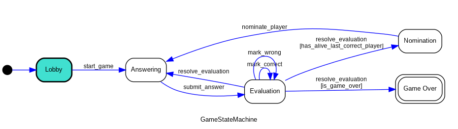
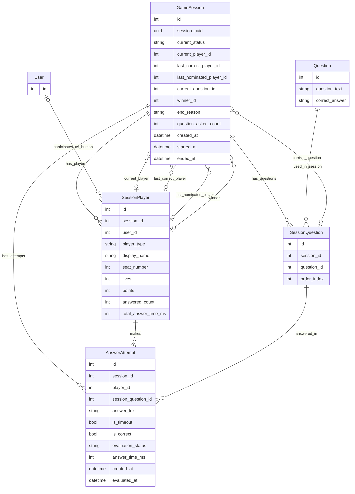

# DEV DOCUMENTATION
For making our lives easier

## Backend

### Installing & running
	You need to have python 3.11+ installed

To run the server:
```bash
chmod +x dev.sh
./dev.sh
```

### Codebase
Server is split into sections:

- ***main project***
	- **core/** - main project directory, settings, routings etc.

- ***applications***
	- **account/** - stuff related to setting up an account, logging, registering, authentication etc. *(HTTP requests mostly)*
	- **social/** - chat, friends system *(HTTP + websockets)*
	- **game/** - game logic *(ws mostly)*


>The sections range might change later in the developement (I hope not though)

### Service layer pattern
We're using [this styleguide](https://github.com/HackSoftware/Django-Styleguide) meaning mostly splitting business logic from interface (sending requests).

It means our code structure looks like this:
- `selectors.py` (for reading endpoints) and `services.py` (for creating/editing/deleting endpoints) - storing HTTP endpoints logic
- `apis.py` (for HTTP) and `consumers.py` (for ws) - handling interface
- `serializers.py` - validation schemes
- `models.py` - database tables structure (for ORM)
- `urls.py` (HTTP) and `routing.py` (ws) - url routing 

### Game section
#### Game logic

Base game loop is constructed as a finite state machine (FSM) visualized as a graph below:


,where:

- `Lobby` – waiting for players and game start
- `Answering` – current player answers a question
- `Evaluation` – answer is evaluated (correct / wrong / timeout)
- `Nomination` – last correct player selects next player
- `GameOver` – game finished


#### Game Data model (ORM)

*Where `User` entity is a placeholder for actual entity of registered user (TBA)*.


### Endpoints

- `http://127.0.0.1:8000/api/docs/` - HTTP endpoints documentation (+ manual testing)
- `docs/WEBSOCKET_EVENTS.md` - websocket endpoints documentation


		To test websocket endpoints manually you need to use wscat or install Postman

- To run automatic tests run the following command: 
	```bash
	python3 manage.py test
	```
## Frontend
¯\\_( ͡° ͜ʖ ͡°)_/¯