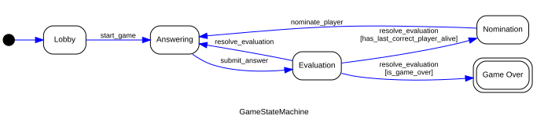
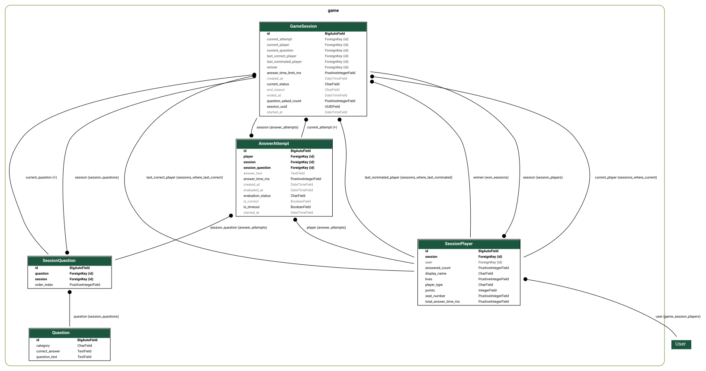

# DEV DOCUMENTATION

For making our lives easier

## Backend

### Installing & running

You need to have python 3.11+ installed.

> [!IMPORTANT]
> First: create .env based on .env.example

To run the server for the first time (sets up isolated dev database):

```bash
make dev-up       # Start DB and Redis
make dev-migrate  # Run migrations
make dev-runserver # Start Django
```

To run production setup:

> [!IMPORTANT]
> If the default setup does not work it might be because default port is blocked
> on campus workstation, read the error and change the port in .env in neccesary

```bash
make up
```

### Codebase

Server is split into sections:

- ***main project***
	- **core/** - main project directory, settings, routings, ASGI/WSGI configuration etc.

- ***applications***
	- **account/** - setting up an account, logging, registering, authentication etc.
	- **social/** - chat, friends system
	- **game/** - game domain logic


>The sections range might change later in the development (I hope not though)

### Service layer pattern

We're using [this styleguide](https://github.com/HackSoftware/Django-Styleguide) meaning mostly splitting business logic from interface (sending requests).

It means our code structure looks like this:
- `selectors.py` - read/query logic, used for fetching and preparing data.
- `services.py` - business logic and state-changing use-cases.
- `apis.py` - HTTP interface layer.
- `consumers.py` - WebSocket interface layer.
- `serializers.py` - input/output validation and serialization.
- `models.py` - database schema and ORM relations.
- `urls.py` / `routing.py` - HTTP and WebSocket routing.

### Game section

#### Structure
The game logic follows a strict layered architecture to separate concerns:
- **`consumers.py` (Presentation Layer):** Manages WebSocket connections, validates incoming JSON payloads using DRF serializers, and passes standardized requests (DTOs) to the action handler.
- **`game_action_handler.py` (Application Layer):** Acts as a dispatcher. It translates external context (e.g., User object, session ID) into database models and invokes the appropriate methods on the game service.
- **`game_service.py` (Domain Layer):** The core business logic facade. It enforces game rules using standalone guards, mutates database state, and handles the lifecycle of the game.
- **`fsm.py` (State Machine):** A pure Finite State Machine (FSM) defining allowed game states and transitions, keeping the flow rules isolated from data mutations.

#### Game logic

Base game loop is constructed as a finite state machine (FSM) visualized as a graph below:



States:

- `Lobby` - waiting for players and game start.
- `Answering` - current player answers a question.
- `Evaluation` - answer is evaluated as correct, wrong or timeout.
- `Nomination` - last correct player selects the next player.
- `GameOver` - game is finished.

#### Game loop rules
Whole game loop is fully backend-driven, frontend only sends player actions and renders the snapshots returned by the backend.

Current architecture:
- `fsm.py` - declared states and trasition with no business logic
- `services/` - business logic including game rules, calling FSM transitions, calling ORM data models
- `selectors.py` - game state snapshots ***(TBA)***
- `consumers.py` - Websocket interface layer

#### Game Data model (ORM)

*Where `User` entity is a placeholder for actual entity of registered user `AUTH_USER_MODEL`*.

*Diagrams generated with*
```bash
python -m statemachine.contrib.diagram game.fsm.GameStateMachine game_fsm.png
python manage.py graph_models game --pydot -g -o game_erd.svg   
```
### Endpoints

| Page | Production (HTTPS) | Local Dev (HTTP) |
| --- | --- | --- |
| Admin panel | <https://localhost:8443/admin/> | <http://127.0.0.1:8000/admin/> |
| API docs (Swagger) | <https://localhost:8443/api/docs/> | <http://127.0.0.1:8000/api/docs/> |
| Questions API | <https://localhost:8443/game/questions/> | <http://127.0.0.1:8000/game/questions/> |
| Users API | <https://localhost:8443/account/users/> | <http://127.0.0.1:8000/account/users/> |
| WebSocket docs | `docs/WEBSOCKET_EVENTS.md` | - |

- To run automatic tests:

 ```bash
 make dev-test
 ```

- To manage local admin accounts:

 ```bash
 make dev-createsuperuser
 ```

- To open a local Django shell:

 ```bash
 make dev-shell
 ```

- To test websocket endpoints manually you need to use wscat or install Postman

## Frontend

¯\\*( ͡° ͜ʖ ͡°)*/¯

## DevOps

### Infrastructure Strategy

- **Isolation**: Production (`prod-transcendence`) and Local Dev (`dev-transcendence`) use separate Docker volumes and project names to prevent data collision.
- **Port Mapping**: Host ports `80` and `443` are blocked. We use `8080` (HTTP) and `8443` (HTTPS) for production. Dev stack uses `5433` (DB) and `6380` (Redis) on host.
- **Security**: Nginx handles SSL termination and redirects all HTTP traffic to HTTPS.

### Redis usage

Redis acts as the backing store for **Django Channels (`CHANNEL_LAYERS`)**.

- **Why**: WebSockets require shared state between different processes (e.g., Daphne serving the socket and a background worker sending a message).
- **Where**: Used in `social/` (chat) and `game/` (real-time updates).
- **Configuration**: Set in `server/core/settings.py`. Uses `redis://redis:6379` in production containers and `redis://127.0.0.1:6380` for local development via `Makefile` overrides.

### Containers

- **api**: Django/Daphne (Python 3.13)
- **web**: React (Nginx serving static files)
- **proxy**: Nginx (Unified entry point + SSL)
- **db**: PostgreSQL 15
- **redis**: Redis 7
